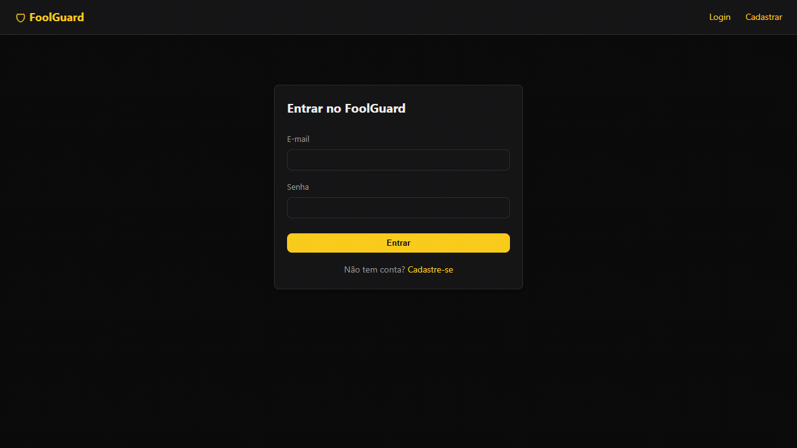
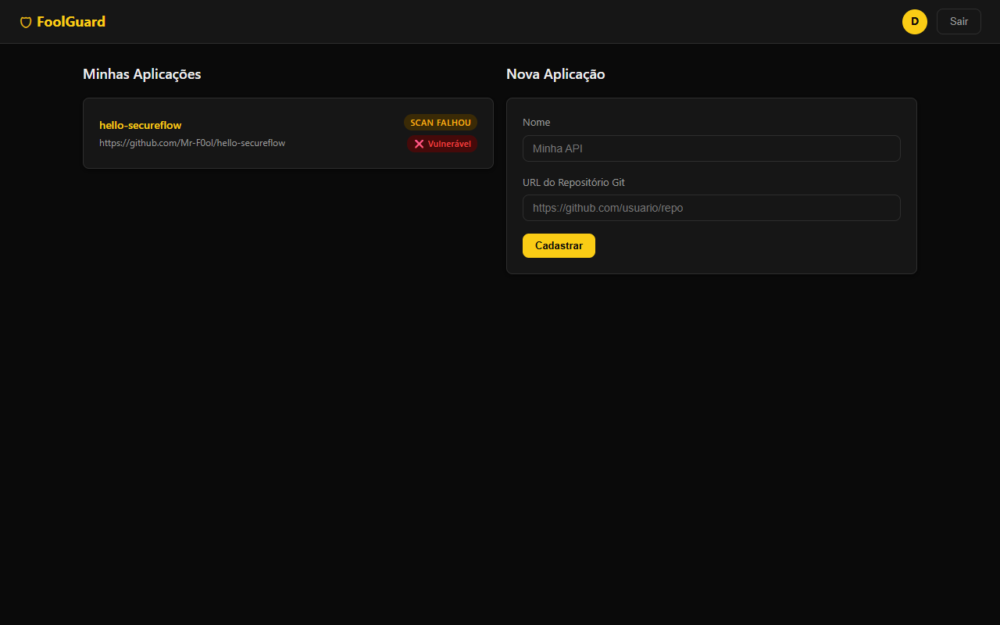
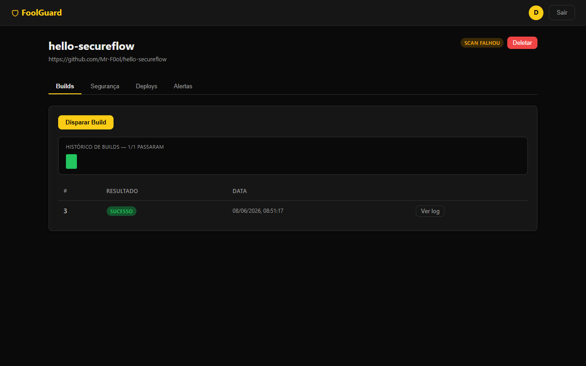
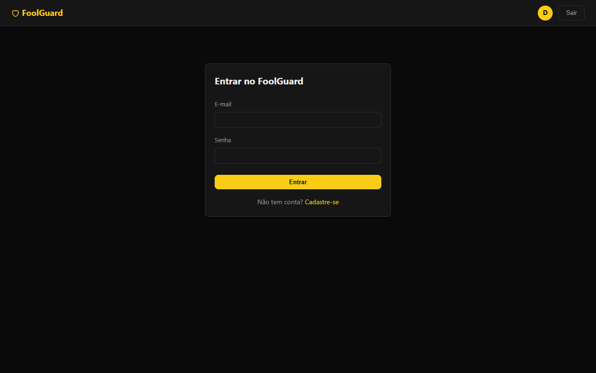
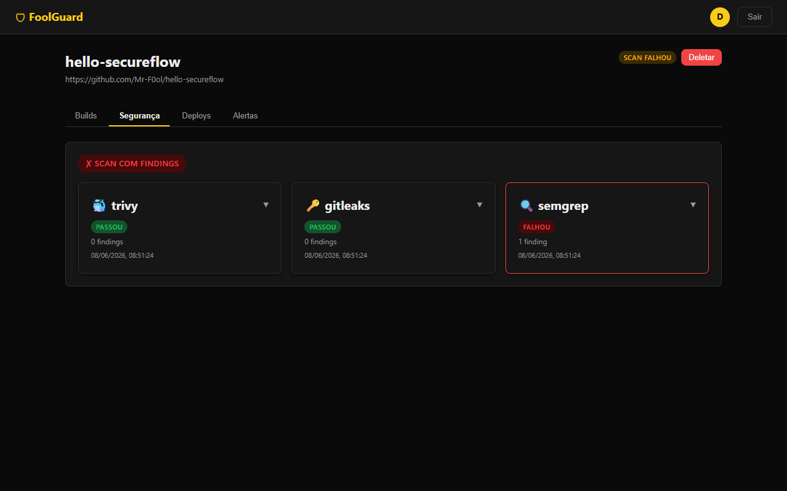

# FoolGuard — Plataforma de Deploy Seguro

[](https://github.com/Mr-F0ol/foolguard/actions/workflows/ci.yml)

> Uma plataforma DevSecOps que **constrói**, **audita**, **publica** e **monitora** aplicações de forma segura — automaticamente. Pense numa versão mini e pessoal de Vercel + Snyk combinados.

---

## Demo



---

## Screenshots

| Dashboard | Detalhe da aplicação |
|---|---|
|  |  |

| Login | Relatório de segurança |
|---|---|
|  |  |

---

## Arquitetura

```
┌─────────────────────────────────────────────────────────┐
│                  PAINEL WEB (React)                      │
│   Dashboard, builds, relatórios de segurança, alertas   │
└───────────────────────────┬─────────────────────────────┘
                            │ (API REST)
┌───────────────────────────▼─────────────────────────────┐
│                     API PRINCIPAL (FastAPI)               │
│   Autenticação JWT, gestão de apps, orquestração         │
└───┬──────────────┬──────────────┬───────────────┬───────┘
    │              │              │               │
┌───▼────┐  ┌──────▼─────┐  ┌─────▼──────┐  ┌─────▼──────┐
│ Build  │  │  Security  │  │   Deploy   │  │  Monitor   │
│ Worker │  │  Scanner   │  │  Service   │  │  Service   │
│        │  │            │  │            │  │            │
│ Docker │  │ Semgrep +  │  │ AWS ECS +  │  │ Health     │
│ build  │  │ Gitleaks + │  │ ECR +      │  │ checks +   │
│        │  │ Trivy      │  │ Terraform  │  │ alertas    │
└────────┘  └────────────┘  └────────────┘  └────────────┘
    │              │              │               │
┌───▼──────────────▼──────────────▼───────────────▼───────┐
│            Redis (fila) + PostgreSQL (dados)             │
└──────────────────────────────────────────────────────────┘
```

---


## Camada de Segurança

| Verificação | Ferramenta | O que detecta |
|---|---|---|
| SAST | Semgrep | SQL injection, XSS, path traversal, hardcoded secrets |
| Secret scanning | Gitleaks | API keys, senhas, tokens no código |
| Análise de imagem | Trivy | CVEs no OS base e em bibliotecas instaladas |
| Scan de deps | Trivy | Vulnerabilidades conhecidas em pacotes |
| Controle de acesso | FastAPI + JWT | Isolamento de dados entre usuários (OWASP A01) |
| Proteção de senhas | bcrypt | Resistência a dump de banco |

---

## Decisões Técnicas

| Decisão | Por quê |
|---|---|
| FastAPI + async | Performance I/O; geração automática de docs; type safety |
| PostgreSQL + SQLAlchemy async | ORM maduro, queries parametrizadas (sem SQL injection), migrations |
| Redis + RQ | Fila simples sem overhead; workers independentes isolam falhas |
| JWT com expiração curta | Limita janela de uso de token vazado |
| Terraform para AWS | Infraestrutura auditável, versionável e reproduzível |
| Semgrep + Gitleaks + Trivy | Todas gratuitas e open source; cobertura em camadas |
| Schemas separados dos modelos | Evita vazamento acidental de campos sensíveis |

---

## Threat Model

O documento [`threat_model.md`](./threat_model.md) mapeia as ameaças à própria plataforma usando a metodologia STRIDE, cobre a superfície de ataque completa e lista os riscos residuais conhecidos com planos de mitigação.

---

## Deploy online (Render)

O arquivo [`render.yaml`](./render.yaml) configura todos os serviços automaticamente no Render.com (plano free):

1. Crie uma conta em [render.com](https://render.com)
2. New → **Blueprint** → conecte o repositório `Mr-F0ol/foolguard`
3. Render detecta o `render.yaml` e cria: API + Frontend + Postgres + Redis

> **Nota**: o worker de build precisa de acesso ao Docker socket, que não está disponível no plano free do Render. As demais funcionalidades (auth, gerenciamento de apps, visualização de resultados) funcionam normalmente. Para funcionalidade completa, use Docker Compose em um VPS.

---

## Como rodar

### Tudo com Docker Compose

```bash
cp .env.example .env
# (opcional) gere uma SECRET_KEY forte: openssl rand -hex 32

docker compose up --build
```

Serviços disponíveis:
- **API**: http://localhost:8000 (docs em /docs)
- **Frontend**: http://localhost:3000
- **Redis**: localhost:6379
- **Postgres**: localhost:5432

### Rodar localmente (sem Docker)

```bash
# Sobe apenas o banco e o Redis
docker compose up db redis -d

# Ambiente virtual
python -m venv .venv
.venv\Scripts\activate      # Windows
source .venv/bin/activate   # Linux/Mac

pip install -r requirements.txt

cp .env.example .env
uvicorn app.main:app --reload

# Worker (outro terminal)
python -m workers.worker

# Monitor (outro terminal)
python -m workers.monitor

# Frontend (outro terminal)
cd frontend && npm install && npm run dev
```

### Rodar os testes

```bash
pytest
```

---

## Estrutura do projeto

```
foolguard/
├── app/
│   ├── main.py
│   ├── api/
│   │   ├── deps.py
│   │   └── routes/
│   │       ├── auth.py          # Registro e login
│   │       ├── applications.py  # CRUD + trigger build
│   │       ├── scans.py         # Resultados de segurança
│   │       ├── deployments.py   # Deploy na AWS
│   │       └── monitor.py       # Alertas de monitoramento
│   ├── core/
│   │   ├── config.py
│   │   ├── database.py
│   │   └── security.py
│   ├── models/models.py         # User, Application, BuildLog, ScanResult, Deployment, MonitorAlert
│   └── schemas/schemas.py
├── workers/
│   ├── tasks.py                 # Build + disparo automático do scanner
│   ├── scanner.py               # Semgrep, Gitleaks, Trivy
│   ├── deploy.py                # ECR + Terraform
│   ├── monitor.py               # Health checks + alertas
│   └── worker.py                # Entrypoint do worker RQ
├── infra/
│   ├── main.tf                  # ECS Fargate + ALB + ECR
│   ├── variables.tf
│   └── outputs.tf
├── frontend/
│   └── src/
│       ├── App.jsx
│       ├── api.js               # Cliente da API
│       ├── pages/               # Login, Register, Dashboard, AppDetail
│       └── components/          # Navbar, StatusBadge
├── tests/
│   ├── test_main.py             # Mês 1
│   ├── test_builds.py           # Mês 2
│   ├── test_scans.py            # Mês 3
│   ├── test_deployments.py      # Mês 4
│   └── test_monitor.py          # Mês 5
├── threat_model.md
├── docker-compose.yml
├── Dockerfile
└── requirements.txt
```
